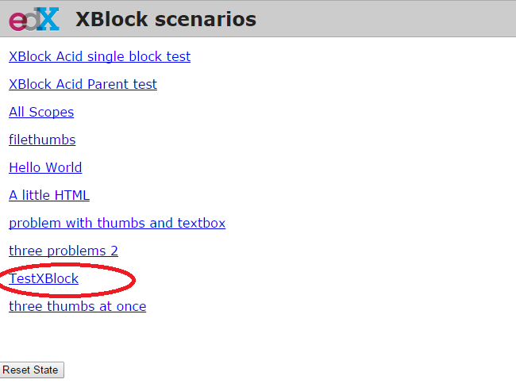

.. _SDK:

Working with the SDK
====================

For most developers, your primary task will be creating xblocks.
So you need a way to test that an xblock that you create does work.
The simplest way to do this is to set up the SDK.

Basic instructions for setting up the SDK:
(see https://github.com/edx/xblock-sdk).

#. Install Python 2.7. ::

	$ sudo apt-get install python

#. Install git. ::

	$ sudo apt-get install git

#. Install pip. ::

	$ sudo apt-get install python-pip

#. Install virtualenv. ::

	$ sudo pip install virtualenv

#. Create the following two directories ::

	$ mkdir ~/envs
	$ mkdir ~/dev

#. Create and activate a new virtualenv. ::

	$ cd ~/envs
	$ virtualenv sdk
	$ . ~/envs/sdk/bin/activate

	If you have multiple verisons of python installed, use python 2.7 to create the new virtualenv.

	$ which python
	/path/to/python2.7
	$ virtualenv -p /path/to/python2.7 sdk

#. Clone repo: https://github.com/edx/xblock-sdk. ::

	$ cd ~/dev
	$ git clone https://github.com/edx/xblock-sdk.git

#. Install your version of xblock-sdk. ::

   $ cd ~/dev/xblock-sdk
   $ make install

#. If you encounterd a problem with libxml, you may need to install: ::

	$ sudo apt-get install libxml2-dev libxslt1-dev

#. Run the django development server ::

	$ python manage.py runserver

#. You should be able to visit http://127.0.0.1:8000/ and see something like this:

	.. image:: _static/workbench_home.png
	   :width: 752px
	   :height: 427px
	   :alt: alternate text
	   :align: center

#. Start creating your new xblock. (you need to run these commands in sdk vitrualenv). ::

	$ cd ~/dev
	$ mkdir test
	$ cd test
	$ python ~/dev/xblock-sdk/script/startnew.py
	short name: test
	Class name: TestXBlock

#. You will need to register your xblock (entry point) in order to be able to see it in workbench (sdk). 
	create the file requirements.txt in test folder to allow to register the package ::
	
	-e .

#. Then run pip to register the test xblock package and allow XBlock to find the entry point (in sdk virtualenv) ::

	$ cd ~/dev/test
	$ pip install -r requiements.txt

#. Now (re)start the workbench server.
   
#. You should be able to visit http://127.0.0.1:8000/ and see your new xblock TestXBlock in the list

